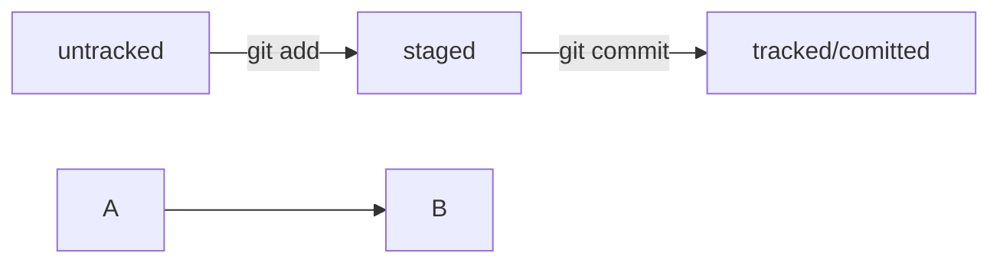

# Пробный репозиторий для работы с курсом от Яндекс Практикум
## Начало работы Git
---
## Команды работы с локальным репозиторием

1.*git init* — создание (инициализация локального репозитория)
2.*git status* - прверить состояние репозитория
3.*git add* - добавить файлы в репозиторий
	git add --all подготовить к сохранению все файлы в репозитории  
	git add имя_файла - добавить файл с указанным именем  
	git add . - добавить всю текущую папку в репозиторий  
	
	
Если провести аналогию, команду git add можно сравнить  
с добавлением товаров в корзину в интернет-магазине,  
а коммит — с оформлением и оплатой заказа.

**Выполнить коммит** — git commit
Сделать коммит можно командой git commit c ключом -m 
(от англ. message — «сообщение»), 
который присваивает коммиту сообщение.
git commit -m ‘Мой первый коммит!’

Просмотреть историю коммитов — git log

## Что такое хеш. Хеширование коммитов
Информация о коммите — это набор данных:   
* когда был сделан коммит,   
* содержимое файлов в репозитории на момент коммита   
* и ссылка на предыдущий, или родительский (англ. parent), коммит.

## Файл HEAD
**Файл HEAD (англ. «голова», «головной»)** — один из служебных файлов папки .git.   
Он указывает на коммит, который сделан последним (то есть на самый новый).

Внутри HEAD — ссылка на служебный файл: *refs/heads/master (или refs/heads/main* в зависимости от названия ветки).   
Если заглянуть в этот файл, можно увидеть хеш последнего коммита.
## Статусы и жизненный цикл файлов в Git

